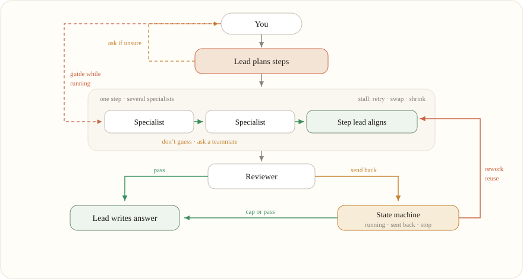

<div align="center">


# Grok-Cli2Web

A local web UI for Grok, styled after Claude

Listens on `127.0.0.1` only · chats stay on disk in `~/.grok/web-chat/`

[Features](#features) · [Multi-agent](#multi-agent) · [Run](#run) · [Auth](#auth) · [`/web`](#grok-cli-web)

</div>

---

## Features

- Streaming replies with Markdown, tables, and KaTeX (`$...$` / `$$...$$`)
- Modes in the composer (chat, research, web, think, code, write, **multi-agent**)
- Copy on code blocks and tables; edit or regenerate messages
- Upload, drag, or paste images and documents
- Load Grok CLI history from `~/.grok/sessions/` and continue those chats here
- `/` command menu: modes, export, usage, workflows, and more
- Server-side tools: web search, X search, and code interpreter (tool stubs are stripped from the answer)
- If a reply loops on “I’ll call / I’ll execute”, it is cut off and recovered in layers: retry, swap model, then shrink the task
- Inspect panel for process and team; **View process** only appears when there is something to show
- Settings split like Claude (account / multi-agent / appearance / language)
- Themes: light, paper, moss, **azure**; dark, midnight, dusk, **cyber**. UI in 中文 / English / 日本語

## Multi-agent

Composer mode **Multi-agent**. The lead plans a few steps; independent steps run together. A step can have several specialists plus a step lead who aligns them. Later steps consume a **filtered fact contract** (claim, source, confidence), not other specialists' essays. The original user goal is pinned and cannot be overwritten by the board.

The headcount slider is a **maximum** (2–144), not a fixed roster. A second slider sets the **run budget** in tokens; the far right is **Unlimited** (♾️). A tighter cap uses fewer specialists and fewer rework rounds, then synthesizes with what it has. Lead and workers use separate models in settings.

<p align="center">
  
</p>

<p align="center"><em>Brain is the state machine, not another chatting agent. Specialists never share full essays — only a filtered contract.</em></p>

- A **server-side state machine (Brain)** owns the run: plan version, contract, who is running, who was sent back, and when to stop. Reviewer JSON is optional; missing output is decided in code.
- Stall recovery is layered (retry → swap model → shrink the brief). After that the agent is marked partial and the crew continues.
- **Reviewer** can send work back. Extra rounds **reuse** existing agents and hand them a changelog of what changed. Two review passes is the hard cap; a score (coverage, confidence, open conflicts, your acceptance points) can stop earlier.
- If Brain cannot decide without guessing, questions are **batched** into one `/`-style choice. The last option is always **Other**.
- Specialists must not invent missing facts. They route uncertainty to the right teammate. Later agents only see contract entries tagged for them.
- **Conflicts** are arbitrated by Brain (higher confidence / sourced claim wins). A true tie is marked contested and a verify/cite specialist is sent once. If both sides stay equally sourced — two official channels disagree — Brain promotes that pair to a permanent **disputed** fact with both citations. Downstream reports the split instead of waiting for a winner. Ordinary workers do not see unresolved contested claims.
- Guidance you type into a worker is written back into Brain (new plan version + updated brief). Later scheduling follows the correction, not the old plan.
- While a run is live, click a worker in the team list or the graph and type guidance. Stop marks every live agent as stopped; switching chats closes the team pane so it does not leak into another conversation.
- Graph: green node = working, green edge = aligning, amber edge = feedback. Nodes can be dragged. **View process** stays hidden when there is nothing to show.

## Run

```bash
git clone https://github.com/QiuGuangwww/Grok_Cli2Web.git
cd Grok_Cli2Web
chmod +x start.sh launch.sh
./launch.sh
```

Then open [http://127.0.0.1:8787](http://127.0.0.1:8787).

| Script | What it does |
| --- | --- |
| `./launch.sh` | Start in the background (or reuse a running instance) and open the browser |
| `./start.sh` | Run in the foreground; `Ctrl+C` stops it |

Python 3.13+ is required (Homebrew Python 3.14 `venv` is flaky on some machines). Dependencies install into `.venv` automatically.

## Auth

Credentials are resolved in this order:

1. `XAI_API_KEY` in the environment (or a gitignored `.env`)
2. An API key saved in the in-app settings page
3. Your existing `grok login` session at `~/.grok/auth.json`

If you already use the Grok CLI, you usually do not need a separate key.

## Grok CLI: `/web`

In a Grok TUI session:

```
/web
```

That starts this app (or reuses it) and opens the browser. The skill lives in this repo at `.grok/skills/web/`. Copy it to your user skills to use `/web` everywhere:

```bash
mkdir -p ~/.grok/skills
cp -R .grok/skills/web ~/.grok/skills/
export GROK_CHAT_HOME="$PWD"   # needed if the repo is not at ~/code/grok-chat
```

## Shortcuts

`Enter` send · `Shift+Enter` newline · `/` commands · `⌘N` new chat · `⌘K` search history

Enter during IME composition (for example Chinese pinyin confirm) does not send.

## Config

| Variable | Meaning |
| --- | --- |
| `XAI_API_KEY` | API key from [console.x.ai](https://console.x.ai) |
| `PORT` | Listen port, default `8787` |
| `GROK_CHAT_HOME` | Repo path used by `/web` and `launch.sh` |

Data lives in `~/.grok/web-chat/` (conversations, uploads, optional key). Do not commit that folder.

## License

MIT
